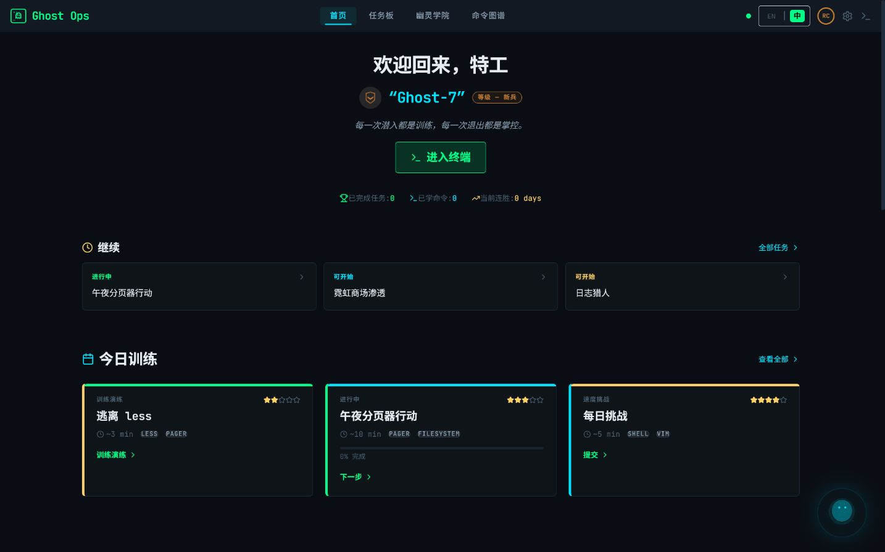
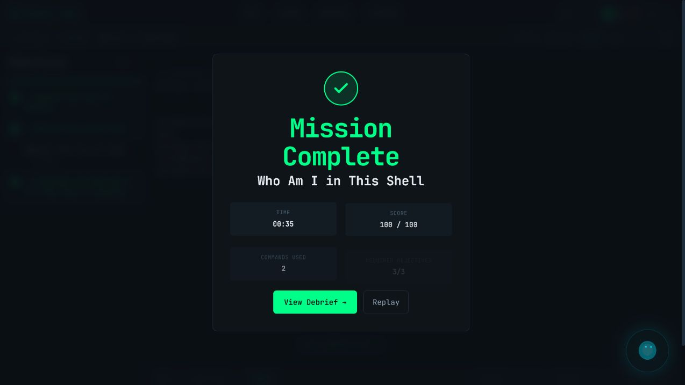
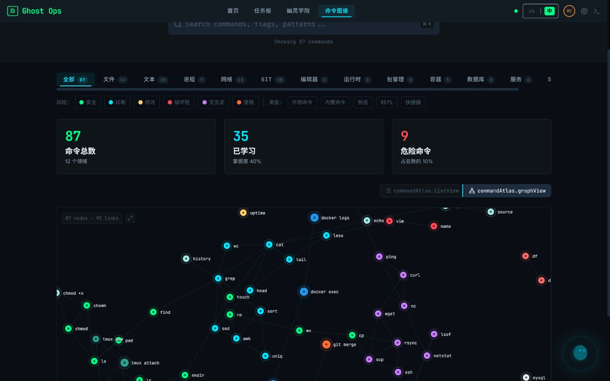
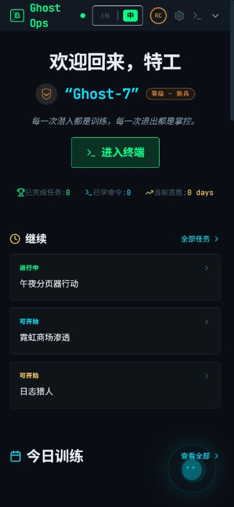
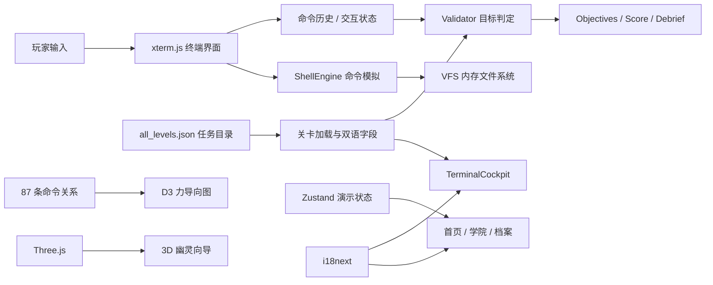

<div align="center">

# ◈ Terminal Ghost Ops

### 终端幽灵行动 · 在浏览器里练会 Linux / DevOps，而不是只背命令

一个赛博朋克风格的终端训练模拟器：接取任务、阅读简报、在隔离的虚拟 Shell 中行动、观察目标即时判定，并在复盘里理解自己为什么成功。

<p>
  
  
  
  
  
  
</p>



<sub>截图来自当前本地运行版本，不是概念稿。界面会检测浏览器语言，也可手动切换中文 / English。</sub>

</div>

> [!IMPORTANT]
> 这是一个纯前端、浏览器内运行的教学模拟器。输入的命令只会操作内存中的虚拟文件系统，不会调用电脑上的真实 Shell，也不会改动宿主机文件。

## 为什么做它

命令行学习最难的部分，不是记住 `grep`、`git` 或 `systemctl` 的拼写，而是建立三个判断：现在系统处于什么状态、下一步动作有什么风险、执行后如何验证结果。Terminal Ghost Ops 把这套判断变成一个可重复训练的任务循环：

1. **侦察**：阅读剧情、目标、环境参数与风险等级。
2. **行动**：在 xterm 驱动的模拟终端中输入命令。
3. **反馈**：目标面板即时更新，危险操作会触发红色警告。
4. **复盘**：查看完成情况、用时、命令数和得分。

它更像一座终端操作训练场，而不是一本静态命令手册。

## 当前内容规模

| 内容 | 数量 | 说明 |
| --- | ---: | --- |
| 任务定义 | **221** | 17 章 × 每章 13 个训练场景 |
| 学习章节 | **17** | 从帮助系统、文件操作到 Git、网络、容器与综合演练 |
| 任务模式 | **4** | 170 Academy / 17 Operation / 17 Boss / 17 Nightmare |
| 目标 | **610** | 551 个必做目标，59 个可选目标 |
| 五级提示 | **1,105** | 每个任务固定 5 级，从方向提示到完整解法 |
| 命令图谱 | **87** | 覆盖 12 个技能领域，包含风险、参数、示例与反模式 |
| 成就 | **20** | 覆盖任务、连胜、技能、速度与隐藏挑战 |

这里刻意使用“任务定义”而不是“221 关全部完成验收”：首关和主交互链路已经真实验证，但部分高级交互型任务仍在迁移到统一事件模型，详见[当前边界](#当前边界与已知问题)。

## 产品一览

<table>
  <tr>
    <td width="50%">
      
      <br /><sub><b>任务板</b> · 221 个任务定义、模式/状态/难度筛选与推荐入口</sub>
    </td>
    <td width="50%">
      
      <br /><sub><b>终端驾驶舱</b> · 真实输入 <code>whoami</code> 后目标即时完成</sub>
    </td>
  </tr>
  <tr>
    <td width="50%">
      
      <br /><sub><b>任务闭环</b> · 必做目标完成后给出用时、得分和复盘入口</sub>
    </td>
    <td width="50%">
      
      <br /><sub><b>命令图谱</b> · 87 条命令、12 个领域和六级风险过滤</sub>
    </td>
  </tr>
  <tr>
    <td colspan="2">
      
      <br /><sub><b>幽灵学院</b> · 17 章 × 13 个训练节点；每章由基础训练逐步进入 Operation、Boss 与 Nightmare</sub>
    </td>
  </tr>
</table>

<details>
<summary><b>查看移动端适配</b></summary>
<p align="center">
  
</p>
<p align="center"><sub>390 × 844 视口实测，无横向溢出。</sub></p>
</details>

## 五分钟启动

### 环境要求

- Node.js `^20.19.0` 或 `>=22.12.0`
- npm（随 Node.js 安装）
- 不需要后端、数据库、API Key 或 `.env`

### Windows PowerShell

```powershell
git clone git@github.com:DerongDeng-dero/Ghost-Mission.git
cd Ghost-Mission\app
npm ci
npm run dev
```

打开 <http://127.0.0.1:3000/>。开发服务器固定监听 `127.0.0.1`，端口被占用时会直接报错，不会悄悄换端口。

### macOS / Linux

```bash
git clone git@github.com:DerongDeng-dero/Ghost-Mission.git
cd Ghost-Mission/app
npm ci
npm run dev
```

然后访问 <http://127.0.0.1:3000/>。

### 第一次体验建议

1. 进入「任务板」。
2. 选择第一关 **Who Am I in This Shell**。
3. 接受任务，在终端依次输入 `whoami`、`id`；`type whoami` 是本关的可选练习。
4. 观察左侧必做目标逐个变绿，并确认终端只操作浏览器内的模拟环境。
5. 在 3/3 Required Objectives 完成后进入 Mission Complete，再打开复盘页。

## 页面与能力

| 路由 | 页面 | 主要能力 |
| --- | --- | --- |
| `#/` | 首页 / Dashboard | 训练入口、继续任务、技能雷达、故事进度、活动、快捷操作与 Three.js 幽灵向导 |
| `#/missions` | 任务板 | 模式、状态、难度、技能筛选；精选与进行中任务 |
| `#/terminal/:missionId` | 终端驾驶舱 | 简报、目标、xterm、HUD、提示、危险命令警告、得分与完成态 |
| `#/academy` | 幽灵学院 | 17 章训练结构、技能树、训练卡与敌人图鉴 |
| `#/atlas` | 命令图谱 | 搜索、12 领域筛选、风险/类型过滤、命令详情，以及可拖拽/缩放的 D3 关系图 |
| `#/profile` | 特工档案 | 技能雷达、热力图、成就和任务记录演示 |
| `#/settings` | 设置 | 主题、终端、辅助功能、声音、玩法与本地配置 |
| `#/debrief/:missionId` | 任务复盘 | 得分拆解、命令时间线、表现卡和下一步建议演示 |

## 训练系统

### 四种任务模式

- **Academy**：单一概念和基础命令的低风险训练。
- **Operation**：把多条命令串成完整处理流程。
- **Boss**：章节综合检验，强调判断、验证与安全。
- **Nightmare**：更少提示、更高复杂度的重复训练。

### 六级风险语言

| 颜色 | 含义 | 示例 |
| --- | --- | --- |
| Green | 安全读取 | `pwd`、`ls`、`cat` |
| Blue | 诊断侦察 | `ps`、`ss`、`dig` |
| Yellow | 修改状态 | `cp`、`mv`、`chmod` |
| Red | 破坏性动作 | `rm`、`kill`、强制操作 |
| Purple | 交互模式 | `vim`、`less`、REPL |
| Black | 受限动作 | 高权限或高影响命令 |

### 五级提示

提示不是一次性公布答案，而是逐级增加信息量：方向 → 概念 → 命令 → 分步演示 → 完整解法。使用提示会进入得分计算，让“自己推理”和“及时求助”之间形成明确取舍。

## 它如何工作



核心设计原则：

- **隔离**：Shell、文件系统和大多数子系统都在浏览器内模拟。
- **数据驱动**：任务、目标、提示、计分和剧情来自关卡目录。
- **即时反馈**：命令事件进入 Validator，目标面板随状态更新。
- **渐进复杂度**：同一章节包含 Academy、Operation、Boss、Nightmare。
- **可视化探索**：D3 展示命令关系，Three.js 提供轻量的全局幽灵引导。
- **静态可部署**：`HashRouter` + `base: './'`，构建产物无需服务端路由重写。

## 项目结构

```text
ghost/
├─ README.md                       # 你正在阅读的主文档
├─ app/                            # 可运行的前端工程
│  ├─ public/                      # 剧情图片、段位图与背景视频
│  ├─ docs/images/                 # 当前版本的真实运行截图
│  ├─ scripts/
│  │  └─ validate-content.mjs      # 关卡目录完整性检查
│  ├─ src/
│  │  ├─ components/               # 导航、任务、学院、终端、档案与 UI 组件
│  │  │  ├─ atlas/CommandGraph3D   # D3 力导向命令关系图
│  │  │  └─ guide/GhostGuide3D     # Three.js 幽灵向导
│  │  ├─ data/                     # 任务、命令、学院与成就数据
│  │  ├─ engine/                   # VFS、Shell、Git、Validator、Hints、Levels
│  │  ├─ i18n/                     # English / 中文资源与语言检测
│  │  ├─ pages/                    # 8 个路由页面
│  │  └─ store/                    # Zustand 演示状态
│  ├─ package.json
│  └─ vite.config.ts
└─ .gitignore                      # 排除依赖、构建物、导入快照与内部规划稿
```

运行时唯一关卡源是 `app/src/data/all_levels.json`。`new/` 是本次吸收完成后的本地导入快照，根目录关卡副本、内部规划稿和旧构建快照都不会进入版本库。

## 开发命令

所有命令都在 `app/` 下执行：

| 命令 | 用途 | 当前状态 |
| --- | --- | --- |
| `npm run dev` | 启动 Vite 开发服务器 | 已验证，`127.0.0.1:3000` |
| `npm run validate:content` | 校验关卡 ID、目标/check 数量和五级提示 | 已通过 |
| `npm run typecheck` | TypeScript 项目检查 | 已通过 |
| `npm run check` | 内容校验 + TypeScript 检查 | 已通过 |
| `npm run build` | 生成生产构建到 `dist/` | 已通过 |
| `npm run preview` | 在 `127.0.0.1:4173` 预览生产构建 | 可用 |
| `npm run lint` | ESLint 全量检查 | 已通过，0 error / 0 warning |

生产构建：

```bash
npm run check
npm run build
npm run preview
```

## 添加或修改任务

任务目录位于 `app/src/data/all_levels.json`。一个任务的核心字段如下：

```json
{
  "id": "whoami-shell",
  "chapter_id": "ch01",
  "mode": "academy",
  "difficulty": 1,
  "skills": ["whoami", "id", "type"],
  "objectives": [
    { "id": "obj-1", "required": true },
    { "id": "obj-2", "required": true },
    { "id": "obj-practice", "required": true }
  ],
  "checks": [
    { "type": "command_used", "pattern": "whoami" },
    { "type": "command_used", "pattern": "id" },
    { "type": "no_red_command_used" }
  ],
  "hints": [
    { "level": 1 },
    { "level": 2 },
    { "level": 3 },
    { "level": 4 },
    { "level": 5 }
  ]
}
```

修改后至少运行：

```bash
npm run validate:content
npm run typecheck
```

当前旧目录没有显式 `objectiveId`。Validator 会把必做的 `obj-N` 依次绑定到进度检查，并用所有进度检查汇总唯一的任务总目标；标记为 optional 的目标不会被错误算作通关条件。命令 pattern 按字面量/Token 边界匹配，不会再把 `*`、`?`、`|` 当作正则表达式。

## 本次真实验收

| 检查 | 结果 |
| --- | --- |
| 开发服务器首页 | HTTP 200，标题 `Terminal Ghost Ops` |
| 桌面视口 | 首页、任务板、命令图谱正常渲染 |
| 幽灵学院 | 17 章可浏览；首章训练编号为 1–13 |
| D3 图谱 | 87 nodes / 95 links，可切换、拖拽与缩放 |
| 连续路由 | 首页 → 任务板 → 学院 → 命令图谱 → 终端，无透明页卡死 |
| 移动视口 | 390 × 844，无横向溢出 |
| 首关输入 `whoami` | 仅对应目标完成，显示 1/4 |
| 再输入 `id` | Required Objectives 完成 3/3，Mission Complete，100/100；`type` 明确标记 Optional |
| 应用 Console | 最终主路径无 error / warning |
| `npm run check` | 通过 |
| `npm run lint` | 通过，0 error / 0 warning |
| `npm run build` | 通过 |

## 当前边界与已知问题

这是当前实现状态，不隐藏工程债务：

- **高级交互事件尚未统一**：35 个目标依赖 `Ctrl-C`、`q`、`:q`、`Esc` 等按键/模式事件，而当前 Validator 主要消费回车提交的命令历史。
- **部分任务 pattern 重复**：13 个任务的两个技能目标共享同一个基础命令 pattern，仍需要更细粒度的参数/结果判定。
- **成功状态未进入事件模型**：当前目标判定尚未把命令 `exitCode` 作为完成条件；后续应升级为包含 raw command、tokens、exit code 和 mode 的 ActionEvent。
- **Git 引擎未接入终端**：`engine/git.ts` 已实现大量 Git 行为，但 TerminalCockpit 目前没有把它接到 Shell 的 `git` 分支。
- **复盘与成长数据含演示内容**：Debrief、档案、热力图和部分进度使用静态/内存数据；刷新页面不会持久化完整成长状态。
- **排行榜未实现**：首页入口当前禁用。
- **多语言仍在完善**：内置 English / 中文切换和双语关卡字段，但部分深层任务文案仍固定显示英文。
- **依赖审计尚未清零**：2026-07-24 的 `npm audit --omit=dev` 报告 4 项（1 high、3 moderate，来自 `lodash` / `recharts` / `react-router*`），当前数据库没有给出自动修复；完整开发依赖树为 129 项。需要逐项升级和回归，不能直接用 `--force` 覆盖。
- **首屏包仍偏大**：生产构建中的主入口约 1.01 MB（gzip 约 289 KB），关卡数据约 755 KB；Three.js、图谱和大目录还需要进一步拆包与按需加载。
- **资源待正式化**：现有剧情人物图属于占位资产，公开发布前应完成版权确认、去水印替换与压缩。

## 安全与隐私模型

- 不执行宿主机命令，不读取本机真实文件系统。
- 没有账号系统、后端 API 或数据库。
- 设置页只在浏览器 `localStorage` 中保存 `ghostops_*` 配置。
- 开发服务器默认只绑定 `127.0.0.1`；不要在不可信网络上改成 `0.0.0.0`。
- Google Fonts 是唯一运行时外部资源；请求失败时界面会降级到系统等宽/无衬线字体，训练功能仍可用。
- 依赖安全数据库会随时间变化，发布前请在联网环境运行 `npm audit` 并人工评估，不要盲目执行破坏性升级。

## 静态部署

```bash
cd app
npm ci
npm run check
npm run build
```

将 `app/dist/` 作为静态目录部署即可。项目使用 Hash Router，因此 GitHub Pages、对象存储或简单静态服务器都不需要额外的 SPA fallback 配置。

## 路线图

- [ ] 用统一 `ActionEvent` 替代纯字符串命令历史，并记录 exit code / mode / key event。
- [ ] 把 GitEngine 正式接入 TerminalCockpit。
- [ ] 为 Validator、Shell、VFS 和 221 个任务目录加入自动化测试。
- [ ] 把成长、成就和复盘从演示状态迁移到可版本化的本地存档。
- [ ] 完成全站中英文案覆盖。
- [x] 清零 ESLint 基线，并补齐内容校验、TypeScript 与构建门禁。
- [ ] 清理重复依赖，迁移到统一的 `@xterm/*` 包。
- [ ] 替换并压缩占位图片，降低当前约 14.1 MB 的公共素材体积。

## 贡献约定

提交改动前建议按顺序运行：

```bash
npm ci
npm run validate:content
npm run typecheck
npm run lint
npm run build
```

如果改动了 UI，请同时检查桌面和 390 px 移动视口；如果改动了任务，请给出“命令输入 → 目标状态 → 完成条件”的可复现证据。

## 许可证

当前项目尚未提供 `LICENSE` 文件。在选择许可证之前，请不要假定它已授权公开复制、修改或再分发；准备公开发布时应优先补充明确的许可证与素材权属说明。

---

<div align="center">
  <b>Every hack is a lesson. Every escape is a command.</b><br />
  <sub>在安全沙箱里把“我好像懂了”变成“我真的做到了”。</sub>
</div>
