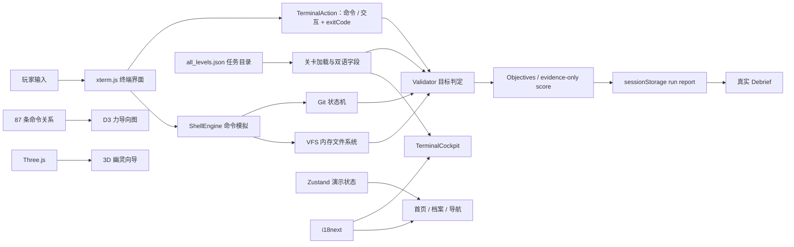

<div align="center">

# ◈ Terminal Ghost Ops

### 终端幽灵行动 · 在浏览器里练会 Linux / DevOps，而不是只背命令

一个赛博朋克风格的终端训练模拟器：接取任务、阅读简报、在隔离的虚拟 Shell 中行动、观察目标即时判定，并在复盘里理解自己为什么成功。

<p>
  
  
  
  
  
  
</p>


<sub>截图采集于 2026-07-24，用于展示真实视觉结构而非概念稿；核心内容统计与图片引用由脚本核对，最新验收快照见下文。</sub>

</div>

> [!IMPORTANT]
> 这是一个纯前端、浏览器内运行的教学模拟器。输入的命令只会操作内存中的虚拟文件系统，不会调用电脑上的真实 Shell，也不会改动宿主机文件。

## 为什么做它

命令行学习最难的部分，不是记住 `grep`、`git` 或 `systemctl` 的拼写，而是建立三个判断：现在系统处于什么状态、下一步动作有什么风险、执行后如何验证结果。Terminal Ghost Ops 把这套判断变成一个可重复训练的任务循环：

1. **侦察**：阅读剧情、目标、环境参数与风险等级。
2. **行动**：在 xterm 驱动的模拟终端中输入命令。
3. **反馈**：目标面板即时更新，危险操作会触发红色警告。
4. **复盘**：查看完成情况、用时、命令数和得分。

它更像一座终端操作训练场，而不是一本静态命令手册。

## 当前内容规模

| 内容 | 数量 | 说明 |
| --- | ---: | --- |
| 任务定义 | **221** | 17 章 × 每章 13 个训练场景 |
| 运行时调用覆盖 | **221 / 221** | 100%；334 条命令检查、234 种 pattern 均有明确运行时归属，但不等于逐关端到端验收 |
| 学习章节 | **17** | 从帮助、导航、权限、Bash、IO 到进程、存储、网络、服务、Git 与远程操作 |
| 任务模式 | **4** | 170 Academy / 17 Operation / 17 Boss / 17 Nightmare |
| 目标 | **610** | 553 个必做目标，57 个可选目标 |
| 五级提示 | **1,105** | 每个任务固定 5 级；结构完整，但 194 关的 H5 仍是批量模板，不能等同于 194 份可执行完整解法 |
| 命令图谱 | **87** | 87 nodes / 95 links，覆盖 12 个技能领域，包含风险、参数、示例与反模式 |
| 成就定义 | **20** | 当前为静态展示数据，尚未接入真实运行后的动态解锁 |

这里刻意区分“任务定义”“调用可达”和“结果可验证”：能力报告以未知能力默认不支持的严格口径审计全部 221 关，目前所有命令检查都能归入 Shell、终端交互或语法模型，未映射项为 0。与此同时，目录的 555 条检查仍只由 334 条 `command_used` 和 221 条 `no_red_command_used` 构成，所以 **221/221 不能表述成 221 关业务结果验收**。详见[当前边界](#当前边界与已知问题)。

## 产品一览

<table>
  <tr>
    <td width="50%">
      
      <br /><sub><b>任务板</b> · 221 个可选择任务、模式/状态/难度筛选与推荐入口</sub>
    </td>
    <td width="50%">
      
      <br /><sub><b>终端驾驶舱</b> · 真实输入 <code>whoami</code> 后目标即时完成</sub>
    </td>
  </tr>
  <tr>
    <td width="50%">
      
      <br /><sub><b>任务闭环</b> · 必做目标完成后给出用时、得分和复盘入口</sub>
    </td>
    <td width="50%">
      
      <br /><sub><b>命令图谱</b> · 87 条命令、12 个领域和六级风险过滤</sub>
    </td>
  </tr>
  <tr>
    <td colspan="2">
      
      <br /><sub><b>幽灵学院</b> · 17 章 × 13 个训练节点；每章由基础训练逐步进入 Operation、Boss 与 Nightmare</sub>
    </td>
  </tr>
</table>

<details>
<summary><b>查看移动端适配</b></summary>
<p align="center">
  
</p>
<p align="center"><sub>390 × 844 视口实测，无横向溢出。</sub></p>
</details>

## 五分钟启动

### 环境要求

- Node.js `^20.19.0 || ^22.13.0 || >=24.0.0`
- npm（随 Node.js 安装）
- 不需要后端、数据库、API Key 或 `.env`

### Windows PowerShell

```powershell
git clone git@github.com:DerongDeng-dero/Ghost-Mission.git
cd Ghost-Mission\app
npm ci
npm run dev
```

打开 <http://127.0.0.1:3000/>。开发服务器固定监听 `127.0.0.1`，端口被占用时会直接报错，不会悄悄换端口。

### macOS / Linux

```bash
git clone git@github.com:DerongDeng-dero/Ghost-Mission.git
cd Ghost-Mission/app
npm ci
npm run dev
```

然后访问 <http://127.0.0.1:3000/>。

### 第一次体验建议

1. 进入「任务板」。
2. 选择第一关 **Who Am I in This Shell**。
3. 接受任务，在终端依次输入 `whoami`、`id`；`type whoami` 是本关的可选练习。
4. 观察左侧必做目标逐个变绿，并确认终端只操作浏览器内的模拟环境。
5. 在 3/3 Required Objectives 完成后进入 Mission Complete，再打开复盘页。

## 页面与能力

| 路由 | 页面 | 主要能力 |
| --- | --- | --- |
| `#/` | 首页 / Dashboard | 训练入口、继续任务、技能雷达、故事进度、活动、快捷操作与 Three.js 幽灵向导 |
| `#/missions` | 任务板 | 模式、状态、难度、技能筛选；精选与进行中任务；结果按 24 条渐进加载 |
| `#/terminal/:missionId` | 终端驾驶舱 | 简报、目标、xterm、HUD、提示、危险命令警告、得分与完成态 |
| `#/academy` | 幽灵学院 | 17 章训练结构、技能树、训练卡与敌人图鉴 |
| `#/atlas` | 命令图谱 | 搜索、12 领域筛选、风险/类型过滤、命令详情，以及可拖拽/缩放的 D3 关系图 |
| `#/profile` | 特工档案 | 技能雷达、热力图、成就和任务记录；当前主要为演示数据 |
| `#/settings` | 设置 | 主题、终端、辅助功能、声音、玩法与本地配置 |
| `#/debrief/:missionId` | 任务复盘 | 读取本次会话的真实分数、耗时、动作、退出码、模式、目录、风险事件和验证结果；无记录时明确显示空态 |

## 训练系统

### 四种任务模式

- **Academy**：单一概念和基础命令的低风险训练。
- **Operation**：把多条命令串成完整处理流程。
- **Boss**：章节综合检验，强调判断、验证与安全。
- **Nightmare**：保留五级提示，但组合更复杂、容错更低。

### 六级风险语言

| 颜色 | 含义 | 示例 |
| --- | --- | --- |
| Green | 安全读取 | `pwd`、`ls`、`cat` |
| Blue | 诊断侦察 | `ps`、`ss`、`dig` |
| Yellow | 修改状态 | `cp`、`mv`、`chmod` |
| Red | 破坏性动作 | `rm`、`kill`、强制操作 |
| Purple | 交互模式 | `vim`、`less`、REPL |
| Black | 受限动作 | 高权限或高影响命令 |

Black 是预留的风险分类；当前 87 条命令和 221 个任务中尚无 Black 条目，不能把六级 taxonomy 理解成六档均已有内容。

### 五级提示

提示以方向 → 概念 → 命令 → 演示 → 解法的五级结构呈现，并按当前语言显示。首次查看任意提示会一次性失去 5 分“无提示奖励”，继续查看不会重复扣分。目录中仍有明显的批量模板痕迹，因此 H5 是内容治理目标，不是自动可信的答案保证。

## 它如何工作



核心设计原则：

- **隔离**：Shell、文件系统和大多数子系统都在浏览器内模拟。
- **数据驱动**：任务、目标、提示、计分配置和剧情来自关卡目录；计分只纳入当前能观察到证据的类别。
- **即时反馈**：命令事件进入 Validator，目标面板随状态更新。
- **渐进复杂度**：同一章节包含 Academy、Operation、Boss、Nightmare。
- **可视化探索**：D3 展示命令关系，Three.js 提供轻量的全局幽灵引导。
- **静态可部署**：`HashRouter` + `base: './'`，构建产物无需服务端路由重写。

## 项目结构

```text
ghost/
├─ README.md                       # 你正在阅读的主文档
├─ app/                            # 可运行的前端工程
│  ├─ public/                      # 剧情图片、段位图与背景视频
│  ├─ docs/images/                 # README 使用的本地实测截图
│  ├─ scripts/
│  │  ├─ validate-content.mjs      # 关卡目录与目标契约检查
│  │  ├─ validate-engine.mjs       # VFS / Shell / Git / Validator 回归
│  │  └─ validate-*.mjs            # 资产、依赖、README 与构建预算门禁
│  ├─ src/
│  │  ├─ components/               # 导航、任务、学院、终端、档案与 UI 组件
│  │  │  ├─ atlas/CommandGraph3D   # D3 力导向命令关系图
│  │  │  └─ guide/GhostGuide3D     # Three.js 幽灵向导
│  │  ├─ data/                     # 任务、命令、学院与成就数据
│  │  ├─ engine/                   # VFS、Shell、Git、Validator、Hints、Levels
│  │  ├─ i18n/                     # English / 中文资源与语言检测
│  │  ├─ pages/                    # 8 个路由页面
│  │  └─ store/                    # Zustand 演示状态
│  ├─ package.json
│  └─ vite.config.ts
└─ .gitignore                      # 排除依赖、构建物、导入快照与内部规划稿
```

运行时唯一关卡源是 `app/src/data/all_levels.json`。`new/` 是本次吸收完成后的本地导入快照，根目录关卡副本、内部规划稿和旧构建快照都不会进入版本库。

## 开发命令

所有命令都在 `app/` 下执行：

| 命令 | 用途 | 当前状态 |
| --- | --- | --- |
| `npm run dev` | 启动 Vite 开发服务器 | 已验证，`127.0.0.1:3000` |
| `npm run validate:content` | 校验关卡 ID、目标/check 数量和五级提示 | 已通过 |
| `npm run validate:engine` | 回归 VFS、Shell、Git、Validator、计分和危险任务契约 | 已通过，126 项回归 |
| `npm run report:capabilities` | 严格盘点 221 关的命令、交互与语法调用覆盖 | 221/221 调用已映射；0 个未支持 pattern，仍不代表 mission E2E |
| `npm run validate:assets` | 校验 README 图片、公开资产引用与体积 | 已通过 |
| `npm run validate:dependencies` | 校验直接依赖使用情况与锁文件来源 | 已通过 |
| `npm run validate:readme` | 用源码统计反向校验本文数字、版本与图片 | 已通过 |
| `npm run typecheck` | TypeScript 项目检查 | 已通过 |
| `npm run check` | 汇总内容、引擎、资产、依赖、README 与类型检查 | 已通过 |
| `npm run build` | 生成 `dist/` 并校验分包和体积预算 | 已通过 |
| `npm run verify` | `check` + ESLint + 生产构建的一站式门禁 | 已通过 |
| `npm run audit:prod` / `audit:all` | npm 生产/完整依赖安全审计 | 均报告 2 个 high，来自同一 React Router RSC 公告；本项目未使用 RSC API，详见安全边界 |
| `npm run preview` | 在 `127.0.0.1:4173` 预览生产构建 | 可用 |
| `npm run lint` | ESLint 全量检查 | 已通过，0 error / 0 warning |

生产构建：

```bash
npm run verify
npm run preview
```

## 添加或修改任务

任务目录位于 `app/src/data/all_levels.json`。下面只是帮助理解结构的节选，**不能直接复制成新关卡**；完整对象还必须提供双语标题/摘要/剧情、双语目标与提示文本、风险、预计时间和完整计分配置。

```json
{
  "id": "whoami-shell",
  "chapter_id": "ch01",
  "mode": "academy",
  "difficulty": 1,
  "skills": ["whoami", "id", "type"],
  "objectives": [
    { "id": "obj-1", "required": true },
    { "id": "obj-2", "required": true },
    { "id": "obj-practice", "required": true }
  ],
  "checks": [
    { "type": "command_used", "pattern": "whoami" },
    { "type": "command_used", "pattern": "id" },
    { "type": "no_red_command_used" }
  ],
  "hints": [
    { "level": 1 },
    { "level": 2 },
    { "level": 3 },
    { "level": 4 },
    { "level": 5 }
  ]
}
```

修改后运行完整门禁：

```bash
npm run validate:content
npm run validate:engine
npm run report:capabilities
npm run verify
```

旧目录绝大多数 check 没有显式 `objectiveId`；目前只有 2/221 关完成了全量显式绑定。兼容层会把必做的 `obj-N` 依次绑定到进度检查，并用所有进度检查汇总唯一的任务总目标；optional 不会被误算作通关条件。加载器还会根据目标契约把可确定的通用 pattern（例如两个连续的 `git`）细化为 `git status`、`git add`。正向目标只读取 `exitCode === 0` 的动作，失败尝试仍进入安全审计；pattern 按字面量/Token 边界匹配，不会把 `*`、`?`、`|` 当作正则表达式。

## 本次真实验收（2026-07-29）

| 检查 | 结果 |
| --- | --- |
| 开发服务器首页 | HTTP 200，标题 `Terminal Ghost Ops` |
| 任务与学院真源 | 17 章标题/领域、每章 13 关与首页摘要均由目录或受校验的轻量摘要生成；不再显示旧 Docker/Vim/Git 章节 |
| 任务可达性 | 移除 `< 50` 魔法锁；221 个任务当前都可从任务板选择，尚无伪造的成长解锁门槛 |
| 移动视口 | 390 × 844；任务简报、终端与复盘无页面级横向溢出 |
| Unicode 输入 | 输入 emoji 后 Backspace 再执行 `whoami`，命令没有残留 UTF-16 半个代理项，目标显示 1/3 |
| 语法与模式 | 未闭合引号返回 exit 2；PSQL、screen、tmux 嵌套进入/退出后能恢复正确宿主模式 |
| 首关对抗路径 | 14 个动作、2 次预期失败后完成 3/3，得分 93/100；Debrief 精确还原 01:58、动作、退出码、模式与目录 |
| 无报告直达复盘 | 显示 “No run report available”，不再回退到静态 87 分 |
| 提示计分 | 浏览器中首次显示提示后明确显示 “-5 points total”，后续提示不叠加扣分 |
| 危险任务契约 | 9 个已加固危险关卡的 H5 从全新模拟器执行并完成；宽泛危险 objective 不能授权任意操作数 |
| 应用 Console | 实测路径无应用 error；仅有系统开启 Reduced Motion 时的 Framer Motion 开发提示 |
| `npm run validate:engine` | 126 项回归通过 |
| `npm run report:capabilities` | 221/221 curated invocation mapping；334 条命令检查、234 种 pattern，0 个未映射项 |
| `npm run verify` | 内容、引擎、资产、依赖、README、类型、Lint 与生产构建全部通过 |
| `npm run audit:prod` / `audit:all` | 均为 2 high；同属未使用的 React Router experimental RSC 路径，普通 SPA 路由实测正常 |
| 生产构建 | 首载 4 个 JS 块，约 1,108 KiB raw / 330 KiB gzip；10 个动态边界，约 645 KiB total JS gzip |

## 当前边界与已知问题

这是当前实现状态，不隐藏工程债务：

- **221/221 是人工维护的调用映射，不是运行证明**：能力报告用 curated allowlist 把 334 条检查归类到命令运行时、终端交互或语法模型；0 个未支持 pattern 影响 0 关、0 条检查，但报告本身不会逐条执行 Shell，也不是 mission E2E。
- **目录缺少结果契约**：555 条检查全部由 334 条 `command_used` 与 221 条 `no_red_command_used` 组成，没有关卡级文件、Git、进程或输出 fixture/check。因此可以证明调用与状态机回归，不能证明 221 关业务结果已经逐项验收。
- **H5 与目标绑定尚未完成源头治理**：194/221 关的第五级提示仍是通用模板，只有 2/221 关的所有 check 显式绑定 `objectiveId`。兼容层会 fail-closed 地修复可确定的旧 pattern，但长期方案仍是结构化 fixture、绑定和逐关执行测试。
- **计分分母因证据而异**：verification 在当前目录中全部 N/A，review 永久排除，shortcuts 只在有关联交互检查时适用；`par_actions` / `par_time_seconds` 目前由检查数和预计时间推导。得分会按适用类别归一到 100，再应用可观察到的危险操作配置罚分，所以不同关卡的 100 分并非同一原始分母。
- **动作报告可审计但不是防篡改日志**：当前记录时间、命令/交互、exitCode、cwd、mode 和每次危险回调，并对 sessionStorage schema 做完整 fail-closed 校验；仍缺 tokens 与前后 state 快照，而且用户可以修改自己的浏览器存储。
- **成长系统仍是演示层**：Debrief 的运行事实来自本次会话，但“新技能”取自关卡 skills，“推荐”是同章候选；Profile、热力图、成就和 XP 仍是静态/内存展示。刷新同一标签页可保留 session report，新的浏览器会话不会保留完整成长状态。
- **排行榜未实现**：首页入口当前禁用。
- **多语言仍在完善**：内置 English / 中文切换和双语关卡字段，但部分深层任务文案仍固定显示英文。
- **包体仍偏大**：当前首载约 1,108 KiB raw / 330 KiB gzip，总 JS 约 645 KiB gzip；关卡目录和 Three.js 仍是最大的延迟块，适合继续按页面与能力拆分。
- **资源待正式化**：`public/` 仍有 14.1 MiB，并包含两个未使用 Logo；现有剧情人物图属于占位资产，公开发布前应完成权属确认、替换与压缩。

## 安全与隐私模型

- 不执行宿主机命令，不读取本机真实文件系统。
- 没有账号系统、后端 API 或数据库。
- 浏览器 `localStorage` 保存 `ghostops_*` 设置、`i18nextLng`、教程/引导标记；`sessionStorage` 以 `ghostops_run_report:*` 保存当前标签页的任务报告。没有把这些数据发送到项目后端。
- 开发服务器默认只绑定 `127.0.0.1`；不要在不可信网络上改成 `0.0.0.0`。
- Google Fonts 是唯一运行时外部资源；请求失败时界面会降级到系统等宽/无衬线字体，训练功能仍可用。
- 当前 npm 审计的 2 个 high 来自 [React Router RSC CSRF 公告](https://github.com/advisories/GHSA-qwww-vcr4-c8h2)。公告明确只影响 experimental RSC API；本项目使用客户端 `HashRouter`，没有 RSC、Action 或服务端请求处理。项目不为消除一条不适用运行路径的告警而强制降级到 7.11.0；目前保留最新 7.18.2，等待 7.x 修复版或单独评估 8.3 升级。
- 依赖安全数据库会随时间变化，发布前请在联网环境运行 `npm audit` 并人工评估，不要盲目执行破坏性升级。

## 静态部署

```bash
cd app
npm ci
npm run check
npm run build
```

将 `app/dist/` 作为静态目录部署即可。项目使用 Hash Router，因此 GitHub Pages、对象存储或简单静态服务器都不需要额外的 SPA fallback 配置。

## 路线图

- [x] 用 `TerminalAction` 统一普通命令与交互动作，并让 `exitCode` 参与目标判定。
- [x] 把 Git 状态机接入 Shell、TerminalCockpit、HUD 与 Validator。
- [x] 为 Validator、Shell、Git 和 VFS 建立无浏览器回归套件。
- [x] 为 221 个任务建立结构化 curated invocation mapping（当前 221/221、0 未映射）。
- [x] 记录动作时间、cwd、mode、exitCode、危险事件，并让 Debrief 读取 schema 校验后的会话报告。
- [ ] 为 221 关补齐 fixture、结果型检查、显式 objective 绑定与逐关 E2E；优先替换 194 个模板 H5。
- [ ] 为动作补充 tokens 与前后 state 快照，支持确定性重放。
- [ ] 把成长、成就、XP 和长期历史从演示状态迁移到可版本化本地存档。
- [ ] 完成全站中英文案覆盖。
- [x] 清零 ESLint 基线，并补齐内容、资产、依赖、README、TypeScript 与构建门禁。
- [x] 清理未使用的直接依赖、迁移到统一的 `@xterm/*` 包，并升级 ESLint 工具链消除开发依赖告警。
- [ ] 跟进 React Router 的非 RSC 修复版本；当前审计保留 2 个仅命中未使用 RSC 路径的 high。
- [ ] 替换并压缩占位图片，降低当前约 14.1 MB 的公共素材体积。

## 贡献约定

提交改动前建议按顺序运行：

```bash
npm ci
npm run verify
npm run audit:prod
npm run audit:all
```

如果改动了 UI，请同时检查桌面和 390 px 移动视口；如果改动了任务，请给出“命令输入 → 目标状态 → 完成条件”的可复现证据。

## 许可证

当前项目尚未提供 `LICENSE` 文件。在选择许可证之前，请不要假定它已授权公开复制、修改或再分发；准备公开发布时应优先补充明确的许可证与素材权属说明。

---

<div align="center">
  <b>Every hack is a lesson. Every escape is a command.</b><br />
  <sub>在安全沙箱里把“我好像懂了”变成“我真的做到了”。</sub>
</div>
