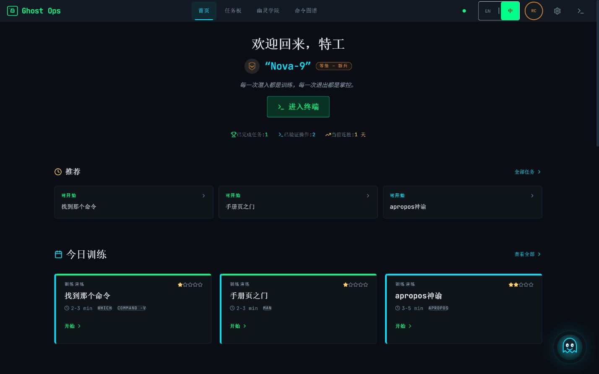
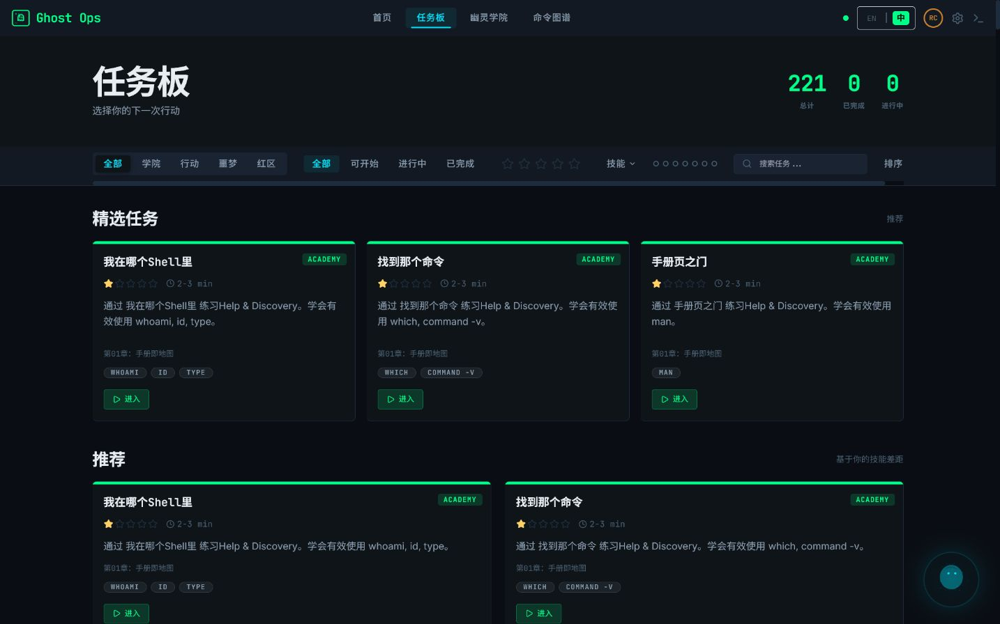
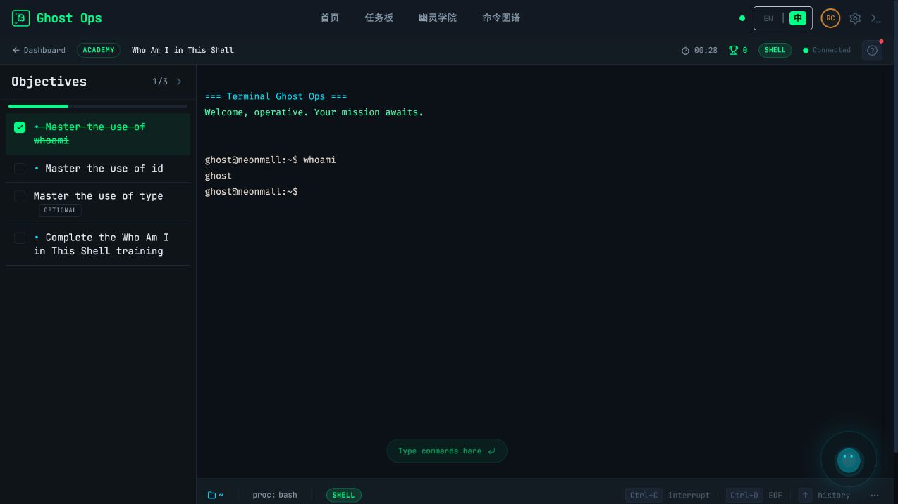
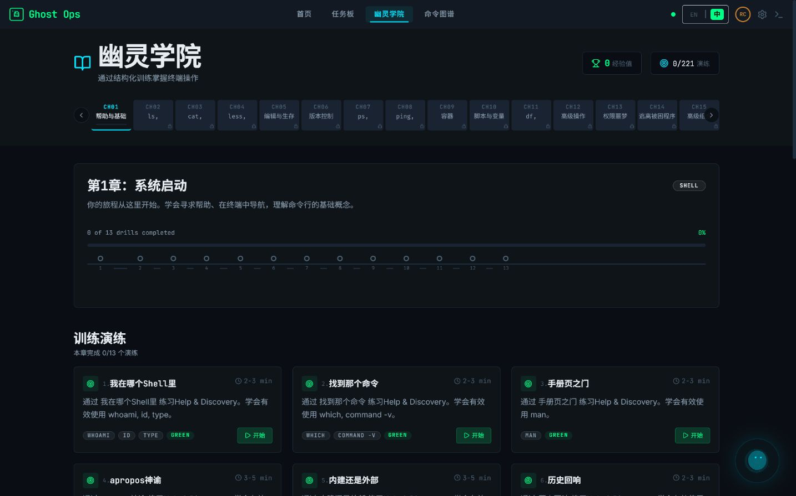
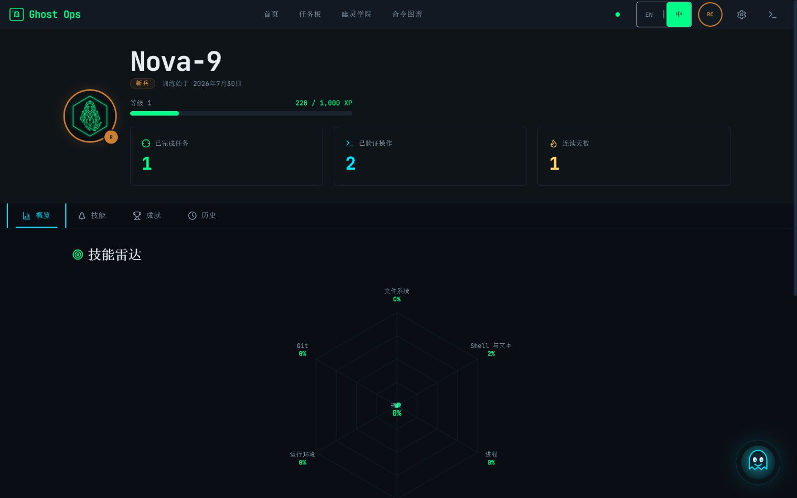
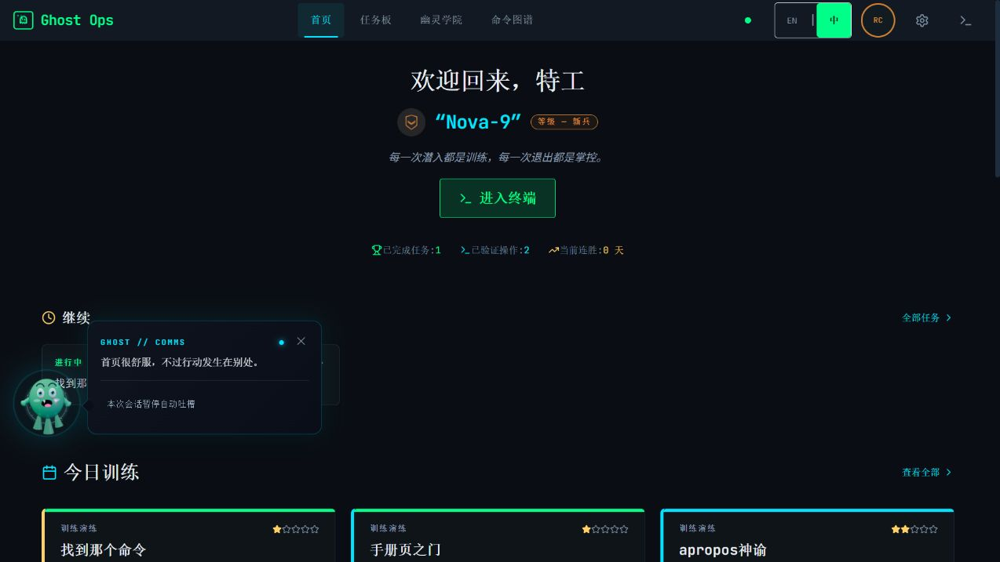
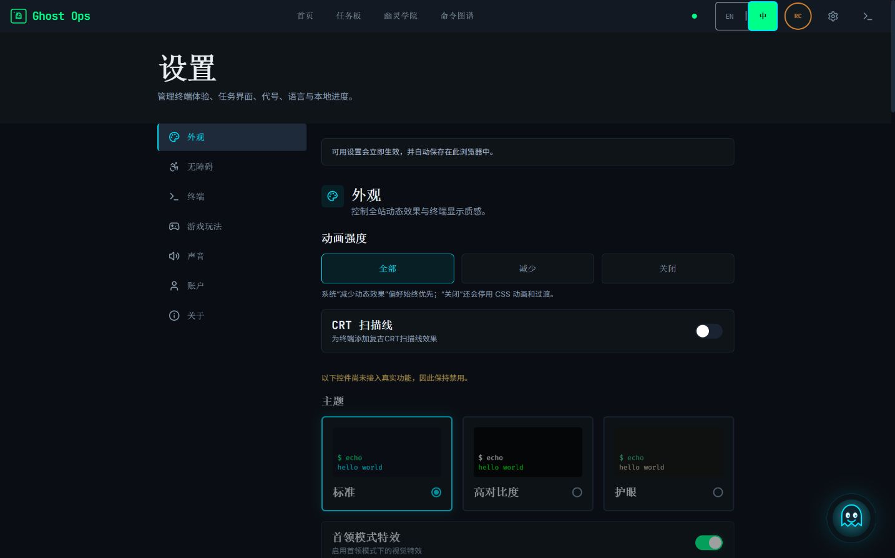
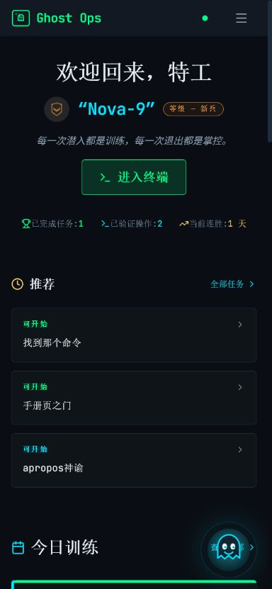
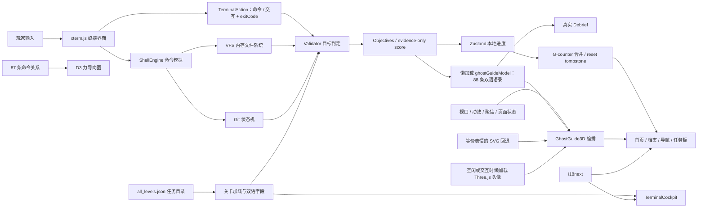

<div align="center">

# ◈ Terminal Ghost Ops

### 终端幽灵行动 · 在浏览器里练会 Linux / DevOps，而不是只背命令

一个赛博朋克风格的终端训练模拟器：接取任务、阅读简报、在隔离的虚拟 Shell 中行动、观察目标即时判定，并在复盘里理解自己为什么成功；一只会沿视口边缘巡游、追踪指针并偶尔吐槽的原创 3D 幽灵会全程担任你的嘴欠搭档。

<p>
  
  
  
  
  
  
</p>



<sub>截图更新于 2026-08-13，来自本地真实运行页面而非概念稿；核心内容统计、图片引用与构建指标由脚本反向核对。</sub>

</div>

> [!IMPORTANT]
> 这是一个纯前端、浏览器内运行的教学模拟器。输入的命令只会操作内存中的虚拟文件系统，不会调用电脑上的真实 Shell，也不会改动宿主机文件。

## 为什么做它

命令行学习最难的部分，不是记住 `grep`、`git` 或 `systemctl` 的拼写，而是建立三个判断：现在系统处于什么状态、下一步动作有什么风险、执行后如何验证结果。Terminal Ghost Ops 把这套判断变成一个可重复训练的任务循环：

1. **侦察**：阅读剧情、目标、环境参数与风险等级。
2. **行动**：在 xterm 驱动的模拟终端中输入命令。
3. **反馈**：目标面板即时更新，危险操作会触发红色警告。
4. **复盘**：查看完成情况、用时、命令数和得分。

它更像一座终端操作训练场，而不是一本静态命令手册。

## 当前内容规模

| 内容 | 数量 | 说明 |
| --- | ---: | --- |
| 任务定义 | **221** | 17 章 × 每章 13 个训练场景 |
| 运行时调用覆盖 | **221 / 221** | 100%；334 条命令检查、235 种 pattern 均有明确运行时归属，但不等于逐关端到端验收 |
| 学习章节 | **17** | 从帮助、导航、权限、Bash、IO 到进程、存储、网络、服务、Git 与远程操作 |
| 任务模式 | **4** | 170 Academy / 17 Operation / 17 Boss / 17 Nightmare |
| 目标 | **610** | 553 个必做目标，57 个可选目标 |
| 五级提示 | **1,105** | 每个任务固定 5 级；77 个 H5 是经新鲜模拟器逐关重放的 `verified_command`，144 个是明确不可直接粘贴的 `guided_actions` |
| 命令图谱 | **87** | 87 nodes / 95 links，覆盖 12 个技能领域，包含风险、参数、示例与反模式 |
| 幽灵点评 | **88** | 每条均有 English / 中文版本；按全局与当前路由分类，最近 12 条不会重复 |
| 成就定义 | **20** | Profile 只展示 3 个可由本地证据验证的成就；其余 17 个是隐藏的规划项，不会伪装成可解锁内容 |

这里刻意区分“任务定义”“调用可达”和“结果可验证”：能力报告以未知能力默认不支持的严格口径审计全部 221 关，目前所有命令检查都能归入 Shell、终端交互或语法模型，未映射项为 0；555/555 条 check 均显式绑定到目标。与此同时，目录的 555 条检查仍只由 334 条 `command_used` 和 221 条 `no_red_command_used` 构成，所以 **221/221 不能表述成 221 次任务 E2E，更不能表述成 221 关业务结果验收**。详见[当前边界](#当前边界与已知问题)。

## 产品一览

<table>
  <tr>
    <td width="50%">
      
      <br /><sub><b>任务板</b> · 221 个可选择任务、模式/状态/难度筛选与推荐入口</sub>
    </td>
    <td width="50%">
      
      <br /><sub><b>终端驾驶舱</b> · 真实输入 <code>whoami</code> 后目标即时完成</sub>
    </td>
  </tr>
  <tr>
    <td width="50%">
      
      <br /><sub><b>任务闭环</b> · 必做目标完成后给出用时、得分和复盘入口</sub>
    </td>
    <td width="50%">
      
      <br /><sub><b>命令图谱</b> · 87 条命令、12 个领域和六级风险过滤</sub>
    </td>
  </tr>
  <tr>
    <td width="50%">
      
      <br /><sub><b>幽灵学院</b> · 17 章 × 13 个训练节点；每章由基础训练逐步进入 Operation、Boss 与 Nightmare</sub>
    </td>
    <td width="50%">
      
      <br /><sub><b>特工档案</b> · 从真实本地任务记录推导 XP、段位、连续训练、热力图、技能与 3 个可验证成就</sub>
    </td>
  </tr>
  <tr>
    <td colspan="2">
      
      <br /><sub><b>3D 幽灵搭档</b> · 本地真实浏览器显式 Full 动效状态：程序化角色、动态表情、指针追眼、边缘巡游与可暂停的双语点评气泡</sub>
    </td>
  </tr>
  <tr>
    <td colspan="2">
      
      <br /><sub><b>实时设置</b> · Follow System / Full / Reduced / None 四态动效、CRT、终端字体/光标/回滚、键盘提示、计时器和得分即时生效；没有消费者的选项继续禁用</sub>
    </td>
  </tr>
</table>

<sub>Profile 与 Settings 截图分别来自独立的本地浏览器状态，只用于证明页面与文案边界，不代表同一账号或连续会话。</sub>

<details>
<summary><b>查看移动端适配</b></summary>
<p align="center">
  
</p>
<p align="center"><sub>390 × 844 视口实测，无横向溢出。</sub></p>
</details>

## 真实本地成长，而不是预填数字

任务完成后，首页、任务板、导航段位与 Profile 会共同读取 `ghostops_progress_v1`，展示已开始/已完成任务、最佳与最近得分、完成次数、最近活动、训练热力图、技能覆盖、XP、段位和连续训练。刷新页面后仍可恢复；数据只留在当前浏览器，不会上传到项目后端。

进度模型专门处理了“重复训练、多个标签页和重置互相打架”这几个浏览器本地状态的基本问题：

- **50 条/任务的审计边界**：每个任务只保留最近 50 条完整完成记录，避免历史无限膨胀；总完成次数由独立计数保留，历史截断不会把第 51 次训练变成“从未发生”。
- **按标签页 writer 划分的 G-counter**：每个 writer 的完成计数只增不减，合并时取各 writer 最大值，两个标签页离线完成后再汇合也不会简单地后写覆盖前写。
- **重置墓碑**：`progressResetAt` 加逻辑序号 `progressResetSerial` 组成 reset tombstone；即使时钟停在同一毫秒或回拨，旧标签页也不能把已重置的数据复活。
- **收敛路径**：支持浏览器 Web Locks 时先合并再写；同时监听 `storage` 事件做跨标签页收敛，锁服务不可用时仍保留事件合并路径。
- **把存储当不可信输入**：只接收生成目录中的 221 个任务 ID，逐条规范化时间、分数、记录与 writer，拒绝伪造未知任务，并对单份进度存储设置 3 MiB 上限。
- **证据不会随短历史一起消失**：最长连续训练等 lifetime milestone 单独持久化，所以最近 50 条历史滚动淘汰后，已经获得的 7 日成就不会重新上锁。

当前真正可判定的成就只有 3 个：任一任务满分、达到 7 日最长连续训练、通过已完成任务验证 50 种不同命令 pattern。XP 按每个已完成任务 120 点、每个已解锁成就 100 点计算；另外 17 个成就定义缺少对应持久化证据，UI 会将它们隐藏，直到实现真实采集与回归测试。

> [!NOTE]
> 这是可靠的浏览器本地进度，不是账号云存档，也不是防篡改成绩系统。用户能修改自己的 `localStorage`；不同浏览器、设备或浏览器配置文件之间不会自动同步。

## 设置页：哪些真的生效

| 能力 | 当前行为 |
| --- | --- |
| 呼号 | 校验并更新全站 callsign，尝试写入本地存储；写入被拒绝时保留当前会话值并明确反馈 |
| 中文 / English | 立即切换 i18next 语言并尝试持久化；失败时显示“仅本次会话”反馈 |
| 动效强度 / CRT | Follow System（默认）尊重设备的 Reduced Motion 偏好；Full 是用户显式覆盖，即使系统要求减弱动效也开启完整 3D 巡游；Reduced 停止非必要空间/连续动效但保留短反馈；None 再通过全局 `skipAnimations` 与 CSS 规则停止动画、过渡和自定义动效。CRT 扫描线即时作用于终端 |
| 终端 | 字号 11–16 px、Fira Code / JetBrains Mono、Block / Line / Bar 光标、闪烁和 1,000 / 5,000 / 10,000 行回滚即时同步到 xterm |
| 任务 HUD | 键盘提示、计时器与得分可独立显示或隐藏 |
| 设置持久化 | 当前 `ghostops_settings_v2` 使用 schema v2、16,384 code-unit 上限和严格值域；首次找不到 v2 时会读取并迁移 `ghostops_settings_v1`，其中旧版 `full` 因原本实际遵循系统偏好而迁移为 `system`。支持 v2 跨标签页收敛，非法或写入失败时 fail-closed 到会话值并反馈 |
| 导出进度 | 下载带 schema/version、任务记录、milestone 与 reset tombstone 的 JSON 快照 |
| 重置进度 | 先写入并复核 reset tombstone，再清理任务报告与引导标记；主重置失败、辅助清理不完整和完全成功是三种不同反馈 |
| 退出登录 | 明确禁用，因为项目没有账号系统 |
| 尚未接线的选项 | 主题、Boss 特效、高对比度、色盲、大字体、音效、背景音乐、默认提示等级、自动保存和点击复制继续禁用；不会把预览伪装成已实现功能 |

## 五分钟启动

### 环境要求

- Node.js `^20.19.0 || ^22.13.0 || >=24.0.0`
- npm（随 Node.js 安装）
- 不需要后端、数据库、API Key 或 `.env`

### Windows PowerShell

```powershell
git clone git@github.com:DerongDeng-dero/Ghost-Mission.git
cd Ghost-Mission\app
npm ci
npm run dev
```

打开 <http://127.0.0.1:3000/>。开发服务器固定监听 `127.0.0.1`，端口被占用时会直接报错，不会悄悄换端口。

### macOS / Linux

```bash
git clone git@github.com:DerongDeng-dero/Ghost-Mission.git
cd Ghost-Mission/app
npm ci
npm run dev
```

然后访问 <http://127.0.0.1:3000/>。

### 第一次体验建议

1. 进入「任务板」。
2. 选择第一关 **Who Am I in This Shell**。
3. 接受任务，在终端依次输入 `whoami`、`id`；`type whoami` 是本关的可选练习。
4. 观察左侧必做目标逐个变绿，并确认终端只操作浏览器内的模拟环境。
5. 在 3/3 Required Objectives 完成后进入 Mission Complete，再打开复盘页。

## 页面与能力

| 路由 | 页面 | 主要能力 |
| --- | --- | --- |
| `#/` | 首页 / Dashboard | 训练入口、继续任务、真实本地统计、故事进度、活动、快捷操作，以及全局可用的交互式 3D 幽灵向导 |
| `#/missions` | 任务板 | 模式、状态、难度、技能筛选；精选与进行中任务；结果按 24 条渐进加载 |
| `#/terminal/:missionId` | 终端驾驶舱 | 简报、目标、xterm、HUD、提示、危险命令警告、得分与完成态 |
| `#/academy` | 幽灵学院 | 17 章训练结构、技能树、训练卡与敌人图鉴 |
| `#/atlas` | 命令图谱 | 搜索、12 领域筛选、风险/类型过滤、命令详情，以及可拖拽/缩放的 D3 关系图 |
| `#/profile` | 特工档案 | 从持久化任务进度推导技能雷达、热力图、3 个证据型成就、XP、段位与完整可用的最近任务记录 |
| `#/settings` | 设置 | 呼号、语言、导出、重置，以及实时动效、终端和任务 HUD 控制；其余 preview-only 控件禁用并标明边界 |
| `#/debrief/:missionId` | 任务复盘 | 读取本次标签页的真实分数、耗时、动作、退出码、模式、目录、风险事件和验证结果；报告未保存时禁用入口，直达无记录时显示空态 |

## 训练系统

### 四种任务模式

- **Academy**：单一概念和基础命令的低风险训练。
- **Operation**：把多条命令串成完整处理流程。
- **Boss**：章节综合检验，强调判断、验证与安全。
- **Nightmare**：保留五级提示，但组合更复杂、容错更低。

### 六级风险语言

| 颜色 | 含义 | 示例 |
| --- | --- | --- |
| Green | 安全读取 | `pwd`、`ls`、`cat` |
| Blue | 诊断侦察 | `ps`、`ss`、`dig` |
| Yellow | 修改状态 | `cp`、`mv`、`chmod` |
| Red | 破坏性动作 | `rm`、`kill`、强制操作 |
| Purple | 交互模式 | `vim`、`less`、REPL |
| Black | 受限动作 | 高权限或高影响命令 |

Black 是预留的风险分类；当前 87 条命令和 221 个任务中尚无 Black 条目，不能把六级 taxonomy 理解成六档均已有内容。

### 五级提示

提示以方向 → 概念 → 命令 → 演示 → 解法的五级结构呈现，并按当前语言显示。首次查看任意提示会一次性失去 5 分“无提示奖励”，继续查看不会重复扣分。H5 现在有可机验的两类契约：77 个 `verified_command` 会在门禁中从全新模拟器执行、完成目标并验证报告持久化；144 个 `guided_actions` 只列出必须结合 H3/H4 补全的动作，明确不是可直接粘贴的 transcript。

### 会巡游、会盯人、也会吐槽的幽灵搭档

右下角向导已经不是一张贴在页面上的装饰图，而是一套有明确降级边界的交互系统：

- **原创程序化 3D 形象**：Three.js 在运行时生成带手臂、波浪尾部、眼睛、瞳孔、嘴部、腮红、灵质颗粒与光晕的幽灵，不依赖外部角色模型；`idle`、`curious`、`mischievous`、`proud`、`startled` 五种情绪会改变表情和动作。指针方向按头像自身边界计算，眼球与瞳孔经过阻尼后跟随，而不是让整个角色机械地绕窗口中心转动。
- **只沿边缘巡游**：80 px 头像沿 8 个安全路点匀速移动，桌面约 24 px/s、移动端约 18 px/s。路径根据 `visualViewport`、窗口缩放和移动端可视区域重新计算；悬停、键盘聚焦、按下指针、显示气泡、页面隐藏、模态框打开或文本输入获得焦点时会暂停，避免焦点目标逃走或遮挡正在进行的任务。
- **88 条中英双语语录**：语料按全局、首页、任务板、学院、图谱、终端、档案、复盘、设置与未知路由分类，通过确定性的 shuffle-bag 排除最近 12 条。首句等待 12–20 秒，后续 45–110 秒；页面隐藏、模态框或文本输入期间不会触发，也不会使用会在后台追赶的 `setInterval`。
- **不强迫用户听它说话**：点击幽灵可立即索取一句，自动吐槽可在气泡内暂停并以当前标签页的 `sessionStorage` 保存。自动吐槽使用 `aria-live="off"`，不会不断打断屏幕阅读器；只有用户主动请求的消息才以 polite live region 播报，头像本身保持可聚焦、可按键操作和 80 × 80 px 命中区。
- **动效与失败都能安全收口**：Follow System（默认）会遵循系统偏好；系统要求减弱动效时显示静态 SVG 和可见的 `SYSTEM · STATIC` CTA，用户激活 CTA 才会写入显式 Full 并加载 3D。Full 明确覆盖系统 Reduced Motion；Reduced / None 保持静态 SVG。允许完整动效时，Three.js 会在浏览器空闲或首次交互时懒加载；3D chunk、WebGL 初始化、渲染、resize 或 context 丢失时都会回退，卸载时清理帧循环、监听器、观察器、几何体、材质与 renderer，设备像素比上限为 1.5。

`npm run validate:ghost-guide` 当前对 88 条中英双语语录执行 953 个对抗性检查，覆盖语料唯一性/长度/安全文本、路由分类、最近重复窗口、随机时间边界、五种视口的边缘路径、畸形输入降级、懒加载边界、四态动效接线、静态 CTA、输入方式感知的焦点恢复、交互抑制、ARIA 语义和 WebGL 生命周期。它是纯函数与源码契约门禁，**不是幽灵在真实浏览器中的视觉回归或完整交互 E2E**。

## 它如何工作



核心设计原则：

- **隔离**：Shell、文件系统和大多数子系统都在浏览器内模拟。
- **数据驱动**：任务、目标、提示、计分配置和剧情来自关卡目录；计分只纳入当前能观察到证据的类别。
- **即时反馈**：命令事件进入 Validator，目标面板随状态更新。
- **渐进复杂度**：同一章节包含 Academy、Operation、Boss、Nightmare。
- **可视化探索**：D3 展示命令关系；幽灵以 SVG 立即可用，并在 Follow System 且系统未要求减弱动效，或用户显式选择 Full 时，于浏览器空闲期或首次交互加载 Three.js。它沿可视区域边缘巡游、跟随指针、按路由吐槽；默认 Follow System 遇到系统 Reduced Motion 会显示静态 CTA，Reduced / None、WebGL 不可用或 chunk 失败时继续使用静态回退。
- **按需动画**：GSAP 只服务 Debrief，并与 Three.js、完整关卡目录分别形成动态 chunk，不进入首载依赖闭包。
- **静态可部署**：`HashRouter` + `base: './'`，构建产物无需服务端路由重写。

## 项目结构

```text
ghost/
├─ README.md                       # 你正在阅读的主文档
├─ app/                            # 可运行的前端工程
│  ├─ public/                      # 剧情图片、段位图与背景视频
│  ├─ docs/images/                 # README 使用的本地实测截图
│  ├─ scripts/
│  │  ├─ validate-content.mjs      # 关卡目录与目标契约检查
│  │  ├─ validate-engine.mjs       # VFS / Shell / Git / Validator 回归
│  │  ├─ validate-ghost-guide.mjs  # 语料、巡游路径、无障碍与 3D 生命周期门禁
│  │  └─ validate-*.mjs            # 资产、依赖、README 与构建预算门禁
│  ├─ src/
│  │  ├─ components/               # 导航、任务、学院、终端、档案与 UI 组件
│  │  │  ├─ atlas/CommandGraph3D   # D3 力导向命令关系图
│  │  │  └─ guide/
│  │  │     ├─ GhostGuide3D         # 巡游、气泡、抑制条件与懒加载编排
│  │  │     ├─ GhostAvatar3D        # 程序化 Three.js 角色、追眼与资源清理
│  │  │     ├─ GhostAvatarFallback  # Reduced Motion / WebGL 失败 SVG 回退
│  │  │     └─ ghostGuideModel      # 88 条双语语录、路由与纯路径模型
│  │  ├─ data/                     # 任务、命令、学院与成就数据
│  │  ├─ engine/                   # VFS、Shell、Git、Validator、Hints、Levels
│  │  ├─ i18n/                     # English / 中文资源与语言检测
│  │  ├─ pages/                    # 8 个路由页面
│  │  └─ store/                    # Zustand 本地进度、并发合并与重置墓碑
│  ├─ package.json
│  └─ vite.config.ts
└─ .gitignore                      # 排除依赖、构建物、导入快照与内部规划稿
```

运行时唯一关卡源是 `app/src/data/all_levels.json`。`new/` 是本次吸收完成后的本地导入快照，根目录关卡副本、内部规划稿和旧构建快照都不会进入版本库。

## 开发命令

所有命令都在 `app/` 下执行：

| 命令 | 用途 | 当前状态 |
| --- | --- | --- |
| `npm run dev` | 启动 Vite 开发服务器 | 已验证，`127.0.0.1:3000` |
| `npm run generate:progress-catalog` | 从 `all_levels.json` 确定性生成本地进度可接受的任务 ID/轻量目录 | 任务目录变更后必须运行；避免手写副本漂移 |
| `npm run validate:content` | 校验关卡 ID、目标/check 数量和五级提示 | 已通过 |
| `npm run validate:engine` | 回归 VFS、Shell、Git、Validator、计分、报告证据链和危险任务契约 | 已通过，141 项回归；不是 141 次任务 E2E |
| `npm run validate:progress` | 对抗性校验真实本地进度、成就、历史边界、多标签页合并和重置墓碑 | 已通过 |
| `npm run validate:settings` | 对抗性校验 settings v2、v1 迁移、严格类型值域、迁移/写入失败反馈、非法/超大存档、跨标签页同步、系统偏好热切换、D3 静态布局、四态动效策略和真实消费者接线 | 已通过，103 项检查 |
| `npm run validate:ghost-guide` | 校验双语语料、去重/调度、五类视口路径、四态动效、静态 CTA、输入方式感知的焦点恢复、交互抑制、ARIA、懒加载与 WebGL 生命周期 | 已通过，88 条语录、953 个对抗性检查；不是浏览器视觉 E2E |
| `npm run validate:audit-policy` | 离线回归零漏洞策略的报告一致性、严重度和完整依赖范围 | 已通过；不依赖安全数据库网络状态 |
| `npm run report:capabilities` | 严格盘点 221 关的命令、交互与语法调用覆盖 | 221/221 调用已映射；334 条命令检查、235 种 pattern，仍不代表 mission E2E |
| `npm run validate:assets` | 校验 README 图片、公开资产引用与体积 | 已通过 |
| `npm run validate:dependencies` | 校验直接依赖使用情况与锁文件来源 | 已通过 |
| `npm run validate:readme` | 用源码统计反向校验本文数字、版本与图片 | 已通过 |
| `npm run validate:build` | 按 manifest 校验引用、首载闭包、动态分块、源码映射和体积预算 | 由 `build` 自动执行 |
| `npm run typecheck` | TypeScript 项目检查 | 已通过 |
| `npm run check` | 汇总内容、引擎、进度、设置、幽灵向导、审计策略、资产、依赖、README 与类型检查 | 已通过 |
| `npm run build` | 生成 `dist/` 并校验分包和体积预算 | 已通过 |
| `npm run verify` | `check` + ESLint + 生产构建的一站式门禁 | 已通过 |
| `npm run audit:prod` / `npm run audit:all` | npm 生产/完整依赖安全审计 | 2026-08-13 均为 0 个漏洞记录 |
| `npm run audit:policy` | 通过 `https://registry.npmjs.org/` 联网审计全部生产、开发、可选与 peer 依赖 | 零漏洞、无 allowlist；任一漏洞、元数据/记录不一致或审计失败都会阻断发布 |
| `npm run release:check` | `verify`（含离线策略回归）+ `audit:policy`（实时安全数据库），用于真实发布判定 | 发布前的完整门禁 |
| `npm run preview` | 在 `127.0.0.1:4173` 预览生产构建 | 可用 |
| `npm run lint` | ESLint 全量检查 | 已通过，0 error / 0 warning |

生产构建：

```bash
npm run release:check
npm run preview
```

当前生产 manifest 的首载闭包只有入口、React vendor 与 Motion vendor：**首载 3 个 JS 块，约 611 KiB raw / 194 KiB gzip；12 个动态边界，约 704 KiB total JS gzip**。Three.js、GSAP、双语吐槽模型与完整关卡目录都保持在首载闭包之外；最大的关卡块为 798.64 kB，同时低于 Vite 告警线与 800 KiB（819,200 bytes）硬预算。

## 添加或修改任务

任务目录位于 `app/src/data/all_levels.json`。下面只是帮助理解结构的节选，**不能直接复制成新关卡**；完整对象还必须提供双语标题/摘要/剧情、双语目标与提示文本、风险、预计时间和完整计分配置。

```json
{
  "id": "whoami-shell",
  "chapter_id": "ch01",
  "mode": "academy",
  "difficulty": 1,
  "skills": ["whoami", "id", "type"],
  "objectives": [
    { "id": "obj-1", "required": true },
    { "id": "obj-2", "required": true },
    { "id": "obj-3", "required": false },
    { "id": "obj-practice", "required": true }
  ],
  "checks": [
    { "type": "command_used", "pattern": "whoami", "objectiveId": "obj-1" },
    { "type": "command_used", "pattern": "id", "objectiveId": "obj-2" },
    { "type": "no_red_command_used", "objectiveId": "obj-practice" }
  ],
  "hints": [
    { "level": 1 },
    { "level": 2 },
    { "level": 3 },
    { "level": 4 },
    { "level": 5, "solution_type": "verified_command" }
  ]
}
```

修改后运行完整门禁：

```bash
npm run generate:progress-catalog
npm run validate:content
npm run validate:engine
npm run validate:progress
npm run validate:ghost-guide
npm run report:capabilities
npm run verify
```

当前 221/221 关均为显式目标绑定，555/555 条 check 都必须提供合法 `objectiveId`；新增或混用 legacy 绑定会直接被内容门禁拒绝。每个 H5 还必须声明 `verified_command` 或 `guided_actions`：前者必须能在全新模拟器中完成任务并持久化报告，后者必须由目标/check 与 H3/H4 确定性生成。正向目标只读取 `exitCode === 0` 的动作，失败尝试仍进入安全审计；pattern 按字面量/Token 边界匹配，不会把 `*`、`?`、`|` 当作正则表达式。

## 验收记录与当前门禁（截至 2026-08-13）

| 检查 | 结果 |
| --- | --- |
| 开发服务器首页 | HTTP 200，标题 `Terminal Ghost Ops` |
| 任务与学院真源 | 17 章标题/领域、每章 13 关与首页摘要均由目录或受校验的轻量摘要生成；不再显示旧 Docker/Vim/Git 章节 |
| 任务可达性 | 移除 `< 50` 魔法锁；221 个任务当前都可从任务板选择，尚无伪造的成长解锁门槛 |
| 本地成长真源 | 首页、任务板、Navbar 与 Profile 共同读取任务存档；不再导入 demo mission history，XP、段位、热力图、技能和活动均从已完成任务推导 |
| 进度对抗性回归 | 覆盖重复训练、同毫秒完成、时钟回拨、50 条/任务淘汰、未知 ID 洪泛、3 MiB 限制、G-counter 多标签页合并、reset tombstone 和冻结时钟连续重置 |
| 成就证据 | UI 只返回 3 个可验证成就；7 日 lifetime milestone 在短历史淘汰或当前 streak 归零后仍保持已获得状态，17 个无证据规划项不展示 |
| 设置边界 | Follow System / Full / Reduced / None 四态动效、CRT、终端与任务 HUD 已接入真实消费者；默认 Follow System 尊重系统偏好，显式 Full 覆盖系统 Reduced Motion。设置使用 schema v2，并可从 v1 迁移；主题、Boss 特效、扩展无障碍、音效、默认提示、自动保存、点击复制与退出登录保持禁用 |
| 设置对抗性回归 | 103 项检查覆盖 v1→v2 迁移、严格类型值域、迁移/写入失败反馈、非法值、超大/畸形存档、跨标签页收敛、系统偏好热切换接线、D3 图谱静态布局与零时长交互、四态动效策略、终端和 HUD 接线 |
| `npm run validate:ghost-guide` | 88 条中英双语语录、953 个对抗性检查通过；覆盖 shuffle-bag、12–20 / 45–110 秒调度、12 条重复窗口、5 种视口路径、四态动效、静态 CTA、输入方式感知的焦点恢复、交互抑制、ARIA、懒加载和 WebGL 生命周期，但不冒充浏览器视觉 E2E |
| 3D 幽灵浏览器实测 | 测试机启用系统 Reduced Motion 时，默认 Follow System 真实呈现静态 SVG 与可见的 `SYSTEM · STATIC` CTA；激活 CTA 后设置切换为显式 Full，Three.js canvas 真实加载并在 2.2 秒沿边缘移动约 71 px。CDP 热切换 no-preference → reduce 无需刷新即回退 SVG、显示 CTA 且 1.8 秒位移为 0；切回 no-preference 后恢复 canvas，并在 1.8 秒移动约 43.5 px。键盘关闭气泡后焦点归还头像且 1.8 秒位移为 0，焦点移开后移动约 56.9 px；鼠标关闭后移动约 26.4 px。新鲜重载后约 23 秒观察到首条自动吐槽（源码调度契约为模型就绪后 12–20 秒）；主动消息为 polite live region。390 × 844 和模态框行为来自上一轮同版本功能的浏览器回归 |
| None / D3 图谱浏览器实测 | `data-motion="none"` 下图谱首节点的 transform 等待 700 ms 前后完全一致；触发 mouseenter 后半径在 80 ms 检查时已经直接从 9 变为 12，没有力导向漂移或渐变补间 |
| HashRouter 跳转到正文 | 在 `#/missions` 实测激活 Skip 后 URL 保持不变、`main` 获得焦点，不再把 `#main-content` 误当路由并进入 404 |
| 移动视口 | 390 × 844；任务简报、终端与复盘无页面级横向溢出 |
| Unicode 输入 | 输入 emoji 后 Backspace 再执行 `whoami`，命令没有残留 UTF-16 半个代理项，目标显示 1/3 |
| 语法与模式 | 未闭合引号返回 exit 2；PSQL、screen、tmux 嵌套进入/退出后能恢复正确宿主模式 |
| 首关对抗路径 | 14 个动作、2 次预期失败后完成 3/3，得分 93/100；Debrief 精确还原 01:58、动作、退出码、模式与目录 |
| 无报告直达复盘 | 显示 “No run report available”，不再回退到静态 87 分 |
| 报告持久化失败 | 报告必须先通过完整 schema/证据校验再写入 `sessionStorage`；写入失败会删除同任务旧报告并禁用 Debrief，直达复盘还会核对最新完成时间与分数，拒绝展示上一轮数据 |
| 提示计分 | 浏览器中首次显示提示后明确显示 “-5 points total”，后续提示不叠加扣分 |
| 危险任务契约 | 9 个已加固危险关卡的 H5 从全新模拟器执行并完成；宽泛危险 objective 不能授权任意操作数 |
| 应用 Console | 实测路径无应用 error；仅有系统开启 Reduced Motion 时的 Framer Motion 开发提示 |
| `npm run validate:engine` | 141 项回归通过；它验证引擎契约，不冒充 141 次浏览器 E2E |
| `npm run validate:progress` | 本地进度、成就、活动与 demo-data 防回流门禁通过 |
| 关卡内容契约 | 221/221 关、555/555 条 check 显式绑定；77 个 `verified_command` 从新鲜模拟器逐关重放、完成目标并验证报告，144 个 `guided_actions` 保持诚实边界 |
| `npm run validate:audit-policy` | 7 个离线策略回归通过；覆盖报告版本、严重度元数据、漏洞记录和零漏洞 fail-closed 行为 |
| `npm run report:capabilities` | 221/221 curated invocation mapping；334 条命令检查、235 种 pattern，0 个未映射项；明确标注 not mission E2E |
| 公开资产 | 删除 `asterion-logo.png`、`neomall-logo.png` 两个孤儿资源；`public/` 当前 11.9 MiB，校验器默认拒绝无引用文件 |
| 延迟加载 | SVG 幽灵立即可用；Three.js 在默认 Follow System 且系统允许动效，或用户显式选择 Full 时，于浏览器空闲期或首次交互加载并有静态回退；语料模型单独懒加载；GSAP 只随 Debrief 加载，Three.js、GSAP 和完整任务目录均不在首载闭包 |
| `npm run verify` | 内容、引擎、进度、设置、幽灵向导、资产、依赖、README、类型、Lint 与生产构建统一纳入门禁 |
| `npm run audit:prod` / `audit:all` | 生产树与完整依赖树均为 0 个漏洞记录；发布策略不含临时例外 |
| 生产构建 | 首载 3 个 JS 块，约 611 KiB raw / 194 KiB gzip；12 个动态边界，约 704 KiB total JS gzip |

## 当前边界与已知问题

这是当前实现状态，不隐藏工程债务：

- **221/221 是人工维护的调用映射，不是 221 次 E2E**：能力报告用 curated allowlist 把 334 条命令检查、235 种 pattern 归类到命令运行时、终端交互或语法模型；0 个未支持 pattern 影响 0 关、0 条检查，但报告本身不会逐条执行 Shell，也不是 mission E2E。
- **目录缺少结果契约**：555 条检查全部由 334 条 `command_used` 与 221 条 `no_red_command_used` 组成，没有关卡级文件、Git、进程或输出 fixture/check。因此可以证明调用与状态机回归，不能证明 221 关业务结果已经逐项验收。
- **H5 已分类，但引导清单不是执行证明**：221/221 关和 555/555 条 check 已完成显式 `objectiveId` 绑定；77 个 H5 是可重放的 `verified_command`，其余 144 个 `guided_actions` 因交互语法、快捷键或缺少必要参数而保持为引导清单，不能宣传成完整命令或逐关 E2E。
- **计分分母因证据而异**：verification 在当前目录中全部 N/A，review 永久排除，shortcuts 只在有关联交互检查时适用；`par_actions` / `par_time_seconds` 目前由检查数和预计时间推导。得分会按适用类别归一到 100，再应用可观察到的危险操作配置罚分，所以不同关卡的 100 分并非同一原始分母。
- **动作报告可审计但不是防篡改日志**：当前记录时间、命令/交互、exitCode、cwd、mode、每个动作由引擎实际发出的成功轨迹和每次危险回调；全局成功证据必须按顺序精确等于逐动作聚合，命令型目标与可选目标会从这些轨迹重新计算。终端与引擎统一将单条命令限制为 20,000 个 UTF-16 code unit，并让一次顶层执行共享最多 100 个执行段；静态可判定的嵌套循环洪泛会在任何副作用前拒绝，函数、脚本、xargs 与 make 的动态展开若触及运行时预算，则回滚该顶层命令对 VFS、Shell、Git 与模拟服务的全部状态变更。事务快照会复制可变容器并复用不可变字符串；VFS 限制为单文件 10 Mi code unit、全局 32 Mi code unit、10,000 个目录项、128 层目录和 40 次符号链接跳转，文件名、软链目标、批量写入或容量中途越界都会 fail-closed，容量型失败会回滚整个顶层命令。Shell、Git 与模拟服务另共享 16 Mi code unit / 20,000 条目的持久状态预算，超限同样整条回滚；系统日志使用 1 Mi code unit / 1,000 条环形缓冲。单次多行粘贴最多提交 100 条命令，且整批超限时原子拒绝；Shell 历史最多保留 1,000 条且总计不超过 1 Mi code unit。任务证据另外限制为 10,000 条成功轨迹与四个实际保留数组合计 512 KiB 的精确 UTF-8 序列化预算，任何 schema 或预算超限都会粘性停止计分并要求 Replay；所有聚合输出均受统一预算约束，截断也不会切开 Unicode 代理对。这些边界避免超长粘贴、深目录、动态展开、批量满盘、无限历史或日志洪泛破坏报告契约并拖垮页面。由于 v1 仍缺 tokens 与前后 state 快照，遇到文件/Git 状态型检查会拒绝保存，而不会信任不可重放的结果。用户仍可整体伪造一份自洽的浏览器存储，因此它不是密码学防篡改日志。保存失败会清除同任务旧报告并禁用 Debrief；直达复盘还必须匹配最新 completion 的时间和分数，不会把上一轮数据伪装成本轮结果。
- **成长是真实本地状态，不是云存档**：Profile、首页、任务板和导航已读取同一份持久化进度；每任务只保留最近 50 条详细历史，G-counter 保留总次数，reset tombstone 阻止旧标签页复活数据。它没有账号、服务端同步、加密或防篡改能力，清理站点数据会删除进度。
- **成就只公开可证明的 3 个**：满分、7 日最长 streak 与 50 种已验证 pattern 可由现有存档推导；其余 17 个定义保持隐藏规划项。诸如“释放 10 GB 空间”在浏览器模拟器中没有可信证据，因此当前不能解锁。
- **设置按消费者逐项开放**：呼号、语言、导出、重置、Follow System / Full / Reduced / None 四态动效、CRT、键盘提示、终端字号/字体/光标/回滚，以及任务计时器/得分已经接线；当前 settings v2 会从 v1 迁移并持久化。主题、Boss 特效、高对比度、色盲、大字体、音效、背景音乐、默认提示、自动保存和点击复制仍禁用。
- **排行榜未实现**：首页入口当前禁用。
- **多语言仍在完善**：内置 English / 中文切换和双语关卡字段，但部分深层任务文案仍固定显示英文。
- **幽灵门禁不是视觉 E2E**：88 条双语语料和 953 个对抗性检查能够证明路径数学、调度边界、四态动效/静态 CTA 接线、输入方式感知的焦点恢复和资源生命周期契约；角色在真实浏览器中的眼神方向、气泡避让、WebGL 故障注入和不同刷新率表现仍需要浏览器场景与视觉回归才能形成发布级证据。
- **首载已缩小，总量仍需预算**：首载 3 个 JS 块，约 611 KiB raw / 194 KiB gzip；12 个动态边界，约 704 KiB total JS gzip。Three.js、双语吐槽模型、GSAP 和完整任务目录已延迟加载，但总 JS 仍接近 750 KiB gzip 门限，需要持续防回归。
- **孤儿资源已删除，素材权属仍需正式化**：`public/` 当前 11.9 MiB，两个无引用 Logo 已移除，资产门禁默认拒绝新孤儿文件；现有剧情人物图仍属于占位素材，公开发布前应完成权属确认、替换与压缩。

## 安全与隐私模型

- 不执行宿主机命令，不读取本机真实文件系统。
- 没有账号系统、后端 API 或数据库。
- 浏览器 `localStorage` 保存任务进度、呼号、`i18nextLng`、当前 `ghostops_settings_v2` 与教程/引导标记；如果只有旧 `ghostops_settings_v1`，应用会将其作为迁移来源读取并写入 v2。`sessionStorage` 以 `ghostops_run_report:*` 保存当前标签页的任务报告，并以 `ghostops_guide_auto_banter_paused` 保存本标签页是否暂停自动吐槽。没有把这些数据发送到项目后端；报告写入被拒绝时，完成弹窗会告警、删除同任务旧报告并禁用复盘入口。
- 开发服务器默认只绑定 `127.0.0.1`；不要在不可信网络上改成 `0.0.0.0`。
- Google Fonts 是唯一运行时外部资源；请求失败时界面会降级到系统等宽/无衬线字体，训练功能仍可用。
- 2026-08-13 的生产依赖树与完整依赖树审计均返回 0 个漏洞记录；`postcss`、`nanoid`、`brace-expansion` 和 ESLint 工具链已更新到无已知公告的锁定解析结果。
- `npm run audit:policy` 固定使用 `https://registry.npmjs.org/` 和 lockfile，显式纳入全部生产、开发、可选与 peer 依赖，逐项核对 audit report v2 的严重度元数据与漏洞记录。策略没有 allowlist：任何级别的新漏洞、报告不一致、网络/解析失败都会使发布门禁失败。
- 依赖安全数据库会随时间变化；真实发布使用联网的 `npm run release:check`，不要把旧审计快照或破坏性的自动升级当成安全证明。

## 静态部署

```bash
cd app
npm ci
npm run check
npm run build
```

将 `app/dist/` 作为静态目录部署即可。项目使用 Hash Router，因此 GitHub Pages、对象存储或简单静态服务器都不需要额外的 SPA fallback 配置。

## 路线图

- [x] 用 `TerminalAction` 统一普通命令与交互动作，并让 `exitCode` 参与目标判定。
- [x] 把 Git 状态机接入 Shell、TerminalCockpit、HUD 与 Validator。
- [x] 为 Validator、Shell、Git 和 VFS 建立无浏览器回归套件。
- [x] 为 221 个任务建立结构化 curated invocation mapping（当前 221/221、0 未映射）。
- [x] 记录动作时间、cwd、mode、exitCode、危险事件，并让 Debrief 读取 schema 校验后的会话报告。
- [x] 用真实本地进度驱动首页、任务板、导航与 Profile，并实现 50 条/任务历史边界、G-counter 多标签页合并、reset tombstone 和存储失败反馈。
- [x] 只公开 3 个证据完备的成就；隐藏无法由当前存档证明的 17 个规划定义。
- [x] 将 Three.js、GSAP 与完整任务目录移出首载闭包；把幽灵升级为原创程序化 3D 角色、边缘巡游、追眼、五种情绪与 88 条路由感知双语吐槽，并实现 Follow System 静态 CTA、显式 Full 覆盖以及 Reduced / None / WebGL / chunk 失败回退。
- [x] 删除两个孤儿 Logo，并把“无引用公开资产”升级为默认失败的门禁。
- [x] 为 221/221 关、555/555 条 check 补齐显式 `objectiveId`，并把 H5 分为 77 个可重放命令与 144 个诚实引导清单。
- [ ] 为 221 关补齐文件/Git/进程/输出 fixture、结果型检查与逐关浏览器 E2E。
- [ ] 为动作补充 tokens 与前后 state 快照，支持确定性重放。
- [ ] 为另外 17 个成就补充可观察证据，或删除不适用于浏览器模拟器的定义。
- [x] 接通并验证 Follow System / Full / Reduced / None 四态动效、CRT、键盘提示、终端字体/光标/回滚、任务计时器和得分设置，并实现 settings v2、v1 迁移与跨标签页收敛。
- [ ] 逐项实现主题、Boss 特效、扩展无障碍、音效、默认提示、自动保存与点击复制；在有真实消费者前保持禁用。
- [ ] 如果产品需要跨设备连续训练，再设计账号、同步冲突、隐私与数据导出/删除契约；当前不伪装成云存档。
- [ ] 完成全站中英文案覆盖。
- [x] 清零 ESLint 基线，并补齐内容、资产、依赖、README、TypeScript 与构建门禁。
- [x] 清理未使用的直接依赖、迁移到统一的 `@xterm/*` 包，并升级 ESLint 工具链消除开发依赖告警。
- [x] 将发布审计改为全依赖树零漏洞、无 allowlist 的 fail-closed 策略。
- [ ] 替换并压缩剩余占位图片，完成素材权属清单；`public/` 当前 11.9 MiB。

## 贡献约定

提交改动前建议按顺序运行：

```bash
npm ci
npm run release:check
```

如果改动了 UI，请同时检查桌面和 390 px 移动视口；如果改动了任务，请给出“命令输入 → 目标状态 → 完成条件”的可复现证据。

## 许可证

当前项目尚未提供 `LICENSE` 文件。在选择许可证之前，请不要假定它已授权公开复制、修改或再分发；准备公开发布时应优先补充明确的许可证与素材权属说明。

---

<div align="center">
  <b>Every hack is a lesson. Every escape is a command.</b><br />
  <sub>在安全沙箱里把“我好像懂了”变成“我真的做到了”。</sub>
</div>
